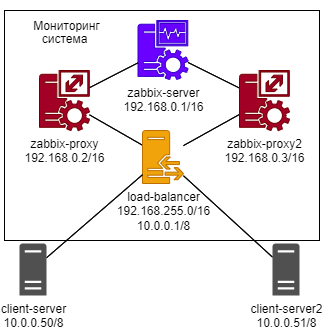
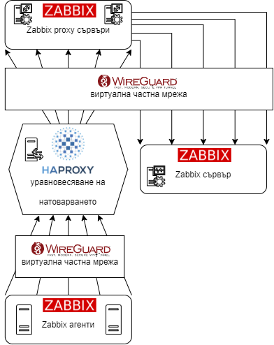
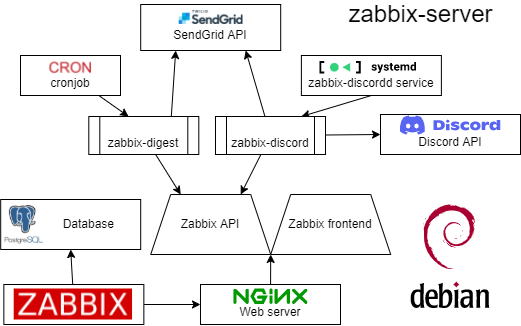

# *Zabbix мониторинг система с load balancing*

*Този проект е създаден като дипломна работа в Технологично училище Електронни системи към Технически университет - София*

## Задание
- Конфигуриране на Zabbix мониторинг система;
- Изграждане и конфигуриране на топология с проксиращи сървъри
посредством Zabbix proxy;
- Изграждане и конфигуриране на VPN мрежа за криптирана връзка между
машините посредством WireGuard протокол;
- Имплементиране на load balancing между proxy сървъри;
- Реализиране на изградената топология във виртуална среда върху Debian
операционна система и набор от виртуални машини, които да се
мониторират;
- Настройване на автоматична регистрация на машини през VPN-а в Zabbix;
- Програмиране на модул за събиране и извеждане на статистики и дневни
отчети на база нови аларми и регистрирани хостове от Zabbix API и
интегриране на модула с Discord API и Email за известяване. 
## Използвани технологии: 
- Zabbix
- Nginx
- PostgreSQL
- WireGuard
- HAProxy
- Debian
- Zabbix API
- SendGrid
- Discord
- Cron
- Systemd
- Python
## Участници в проекта:
* **Йоан Джелекарски** - *дипломант* 
* **Павлин Николов** - *дипломен ръководител*
## Диаграми
### Топология

### Схема на връзките

### Схема на логическата свързаност в zabbix-server

## Приложения
- [Приложение 1](host_configurations/zabbix-server/nginx.conf)
- [Приложение 2](host_configurations/zabbix-server/php-fpm.conf)
- [Приложение 3](host_configurations/zabbix-server/zabbix_server.conf)
- [Приложение 4](host_configurations/zabbix-server/zabbix_agentd.conf)
- [Приложение 5](host_configurations/zabbix-proxy/zabbix_proxy.conf)
- [Приложение 6](host_configurations/zabbix-proxy/zabbix_agentd.conf)
- [Приложение 7](host_configurations/client/zabbix_agentd.conf)
- [Приложение 8](host_configurations/load-balancer/zabbix_agentd.conf)
- [Приложение 9](host_configurations/load-balancer/haproxy.cfg)
- [Приложение 10](reports_module/zabbix-digest/main.py)
- [Приложение 11](reports_module/zabbix-discord/bot.py)
- [Приложение 12](reports_module/zabbix-discord/views.py)
